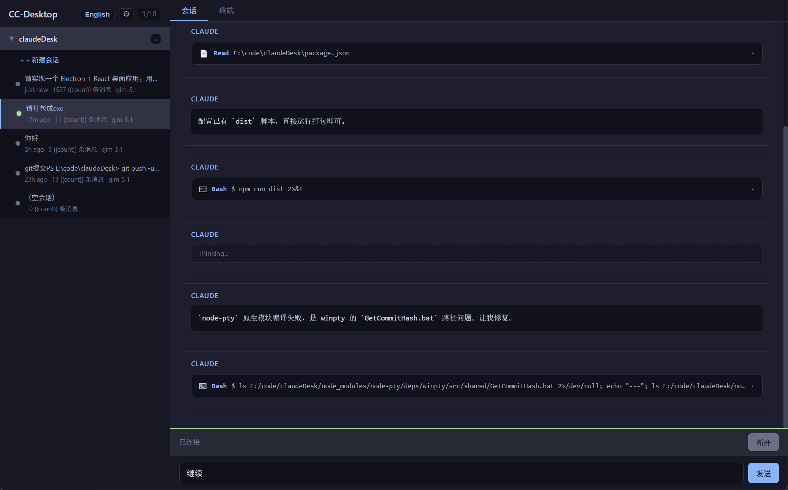

# Claude Code Desktop

**[English](./README.md)** | **[中文](./README.zh-CN.md)** | **[日本語](./README.ja.md)** | **[한국어](./README.ko.md)**

> **Community Open Source Project** — This is a free, open-source desktop GUI for the [Claude Code](https://docs.anthropic.com/en/docs/claude-code) CLI.
> It is **NOT** the official [Claude Desktop](https://claude.ai/download) app by Anthropic (which requires a paid subscription).
> This project is MIT-licensed and is not affiliated with, endorsed by, or connected to Anthropic.

   



## Features

- **Session Browser** — Automatically discovers all Claude Code projects and sessions from `~/.claude/projects/`
- **Real-time Sync** — Watches `.jsonl` session files for changes, auto-updates as conversations progress
- **Conversation View** — Formatted message display with collapsible thinking blocks and tool call cards
- **Terminal Integration** — Full `xterm.js` terminal for direct CLI interaction with Claude Code
- **Session Resume** — Click any session to resume it via `claude --resume <session-id>`
- **Permission Prompts** — Interactive Allow/Always/Deny buttons when Claude Code requests tool permissions
- **Cross-platform** — Works on Windows, macOS, and Linux

## Why This Project?

Claude Code is an incredibly powerful CLI tool — but not everyone lives in the terminal.

As developers, we wanted a more visual way to manage multiple sessions, browse conversation history, and keep an overview of our projects. Switching between terminal tabs and scrolling through long outputs gets old fast.

So we built Claude Code Desktop — a free, open-source GUI that wraps the Claude Code CLI you already know and love. No subscription needed beyond your Claude Code CLI access. Just install, connect, and go.

**The goal is simple:** make Claude Code more accessible and productive for everyone, while keeping it 100% free and open source.

## How Is This Different from Claude Desktop?

| | Claude Desktop (Official by Anthropic) | Claude Code Desktop (This Project) |
|---|---|---|
| **Type** | Official Anthropic product | Third-party community project |
| **Cost** | Requires Claude Pro / Max subscription | **Free & Open Source** (MIT License) |
| **Interface** | Chat-focused GUI | Terminal + Conversation hybrid GUI |
| **Backend** | Anthropic API directly | Claude Code CLI |
| **Open Source** | Closed source | **Fully open source** |
| **Target Users** | General users | Developers using Claude Code CLI |

Both are great tools — they just serve different needs. If you want a polished chat experience with Claude, use the official Claude Desktop. If you're a developer who lives in Claude Code CLI and wants a visual manager for your sessions, give this a try.

## Getting Started

### Prerequisites

- [Node.js](https://nodejs.org/) >= 18
- [Claude Code CLI](https://docs.anthropic.com/en/docs/claude-code) installed and configured

### Install

```bash
git clone https://github.com/HenryMu/claude-code-desktop.git
cd claude-code-desktop
npm install
```

### Development

```bash
npm run dev
```

### Build

```bash
npm run build
```

## Architecture

```
src/
├── shared/types.ts              # Shared TypeScript types (IPC, JSONL, Session)
├── main/
│   ├── index.ts                 # Electron main process entry
│   ├── ipc-handlers.ts          # IPC channel registration
│   ├── session-watcher.ts       # File watcher + incremental JSONL parser
│   ├── claude-manager.ts        # node-pty process lifecycle manager
│   └── path-utils.ts            # Cross-platform path sanitize/unsanitize
├── preload/
│   └── index.ts                 # contextBridge API
└── renderer/
    ├── index.html
    └── src/
        ├── App.tsx              # Root layout with tab state
        ├── components/
        │   ├── Sidebar.tsx      # Project tree + session list
        │   └── MainContent.tsx  # Conversation + Terminal tabs
        ├── hooks/
        │   ├── useSessionWatcher.ts  # Session data IPC listener
        │   └── useClaudeManager.ts   # PTY process management
        └── styles/
            └── global.css       # Catppuccin dark theme
```

## Tech Stack

| Component | Technology |
|-----------|-----------|
| Desktop Framework | [Electron](https://www.electronjs.org/) 34 |
| Build Tool | [electron-vite](https://electron-vite.org/) |
| Frontend | [React](https://react.dev/) 19 + [TypeScript](https://www.typescriptlang.org/) |
| Terminal | [xterm.js](https://xtermjs.org/) + [node-pty](https://github.com/microsoft/node-pty) |
| File Watching | [chokidar](https://github.com/paulmillr/chokidar) |
| Styling | CSS (Catppuccin dark theme) |

## License

[MIT](./LICENSE)
